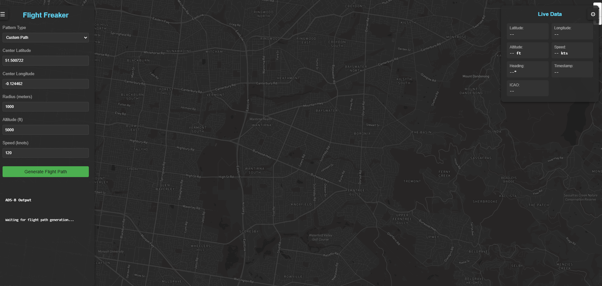

# Flight-freaker

Welcome to **Flight-freaker**! This project is designed to simulate or interact with ADS-B (Automatic Dependent Surveillance-Broadcast) data. It provides a web interface to visualize or manipulate flight data.

[](https://www.youtube.com/watch?v=N_fD6_eGAa0) 
## Prerequisites

Before running the project, ensure you have the following installed:

- **Python 3.x**: The project is written in Python, so you'll need Python 3 installed on your system.
- **pip**: Python's package manager to install dependencies.

## Installation

1. **Clone the repository**:
   ```bash
   git clone https://github.com/scs-labrat/Flight0-freaker.git
   cd Flight0-freaker
   ```

Install dependencies:
Run the following command to install the required Python packages:

``` 
bash
Copy
pip install -r requirements.txt
``` 

(If you don't have a requirements.txt file, you can skip this step or create one with the necessary dependencies.)


## Running the Project
Start the ADS-B Server:
Run the adsb_server.py script to start the ADS-B server:

```bash

python adsb_server.py
```

## Start the Python Web Server:
In the same directory, start a Python web server to serve the web interface:

```bash

python -m http.server 8000
```
Access the Web Interface:
Open your web browser and visit the following URL to access the homepage:

```bash

http://localhost:8000/
```
Project Structure
adsb_server.py: The main server script that handles ADS-B data.

index.html: The homepage or web interface (if applicable).

Other files: Additional scripts, assets, or data files required for the project.

## Contributing
If you'd like to contribute to this project, feel free to fork the repository and submit a pull request. Please ensure your code follows the project's style and includes appropriate documentation.

License
This project is licensed under the MIT License. Feel free to use, modify, and distribute it as per the license terms.

Support
For any issues or questions, please open an issue on the GitHub repository.

Enjoy exploring Flight0-freaker! ✈️

Copy

### Key Points in the README:
1. **Prerequisites**: Lists Python and pip as requirements.
2. **Installation**: Guides users on cloning the repo and installing dependencies.
3. **Running the Project**: Explains how to start the ADS-B server and Python web server, and how to access the web interface.
4. **Project Structure**: Briefly describes the main files.
5. **Contributing, License, and Support**: Standard sections for open-source projects.

You can customize this README further based on your project's specific details or additional features.